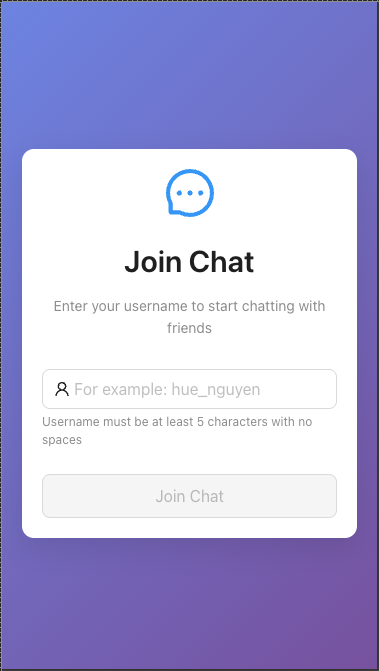
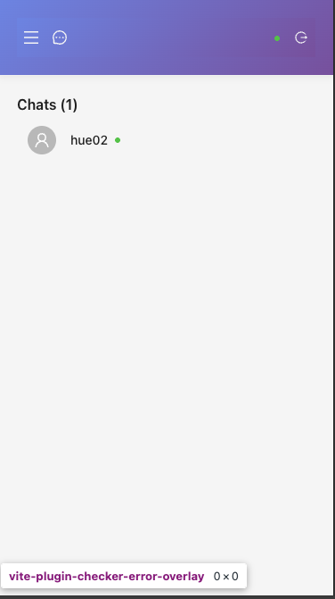
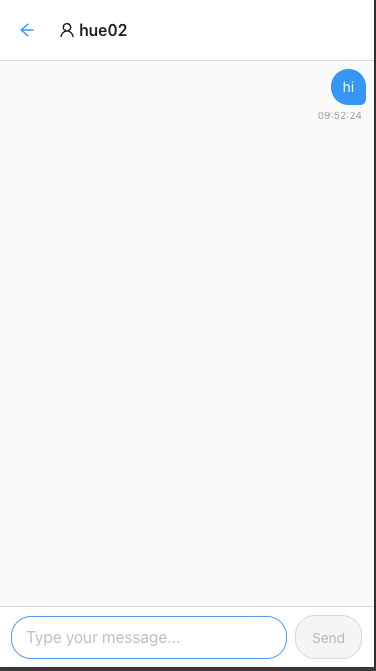

# Wave Chat Application

This is a minimal one-to-one text chat application built to demonstrate high-quality, production-ready TypeScript code. The focus is on clean architecture and best practices rather than feature complexity.

**What this application includes:**
- A fully functional real-time chat system
- Clean, maintainable code architecture
- Modern TypeScript implementation

**What this application excludes:**
- Production authentication system
- Database persistence
- Scalability optimizations

This is intentionally a focused implementation to showcase code quality and architectural decisions. I'd be happy to discuss scalability, performance, and production considerations in our next conversation.

## Core functionalities
- User Simple Authentication: Username-based join system (5+ chars, no spaces)
- Real-time Friends List: See online users instantly.
- Private Messaging: Direct one-on-one conversations
- Typing Indicators: Real-time typing status updates
- Connection Status: Visual feedback for Socket.io connection state
- Mobile-Optimized: Touch-friendly interface with mobile keyboard handling
- Auto-Reconnection: Clean connection handling with automatic reconnection on page reload 

## Frontend

### Architecture patterns
- Context + Hooks: Centralized state management using SocketProvider, UserProvider, and custom hooks. I avoided introducing external state management libraries (Redux, Zustand, Jotai) as they were unnecessary for this application's scope. Instead, I leveraged React's built-in context and hooks to create clean, maintainable state management with proper separation of concerns.
- Local component state for UI interactions
- Protected routes with authentication guards (home and chat pages)
- Memory Leak Prevention: Component mount tracking, timeout cleanup, event listener removal
- TypeScript Integration: Strongly typed props, socket events, and component interfaces
- Component Composition: Reusable components with clear prop interfaces
- Consolidated page content management

### UI

#### Real-Time UI Features
- Socket.io Integration: Live connection status with visual badges
- Typing Indicators: Real-time "user is typing..." feedback in chat interface
- Optimistic Updates: Messages appear instantly for sender before server confirmation
- Auto-Scroll Management: Smooth scroll to latest messages with ref-based implementation

#### Mobile Friendly
- Mobile Keyboard Handling: Visual viewport API integration for keyboard accommodation
- Adaptive UI: Hidden elements on mobile (app title, usernames), back navigation in chat

#### Interactive Components
- Form Validation: Real-time username validation (5+ chars, no spaces) with immediate feedback
- Message Bubbles: Distinct styling for own vs other messages with proper alignment
- Navigation: URL-based routing (/chat?friend=username)
- Loading States: Button spinners, disabled states, and comprehensive error handling
- Keyboard Navigation: Enter to send, Enter for new lines, proper tab order
- Toast Notifications: User-friendly feedback for errors, success, and system events
- Message Filtering: Conversation-based message display by participants


## Backend

### Architecture Patterns
- Event-Driven Architecture: Socket.io-based real-time communication with Express.js hybrid server
- Dual Protocol: HTTP server with WebSocket overlay for real-time features
- Event Handlers: Clean separation of Socket.io events (user_join, send_private_message, typing_start/stop)
- Stateful Connections: Maintains user sessions through socket connections
- In-Memory Data Management
- Map-based O(1) lookup
  ```
  const connectedUsers = new Map<string, User>();     // username → User
  const socketsToUsers = new Map<string, string>();   // socketId → username
  ```

### Technical Decisions
Due to the focused scope, the backend intentionally excludes:
- Database integration (would use SQLite for a lightweight, self-contained solution in production)
- Production authentication (currently uses simple username-based auth)
- Offline message support (no message queuing for disconnected users)
- Horizontal scalability (single-server architecture)

### Real-time Implementation
**Connection Lifecycle:**
1. Socket connects → awaits user_join event
2. User authentication → dual map storage (user data + socket mapping)
3. Broadcast updated user list to all connected clients
4. Handle messaging and typing events until disconnect

### Core Data Models
```typescript
interface User {
  username: string;
  socketId: string;
  joinedAt: Date;
}

interface Message {
  id: string;           // UUID generated
  from: string;
  to: string;
  content: string;
  timestamp: Date;
  delivered: boolean;
}
```

## Some screenshots

Login Page



Home Page



Chat Page


